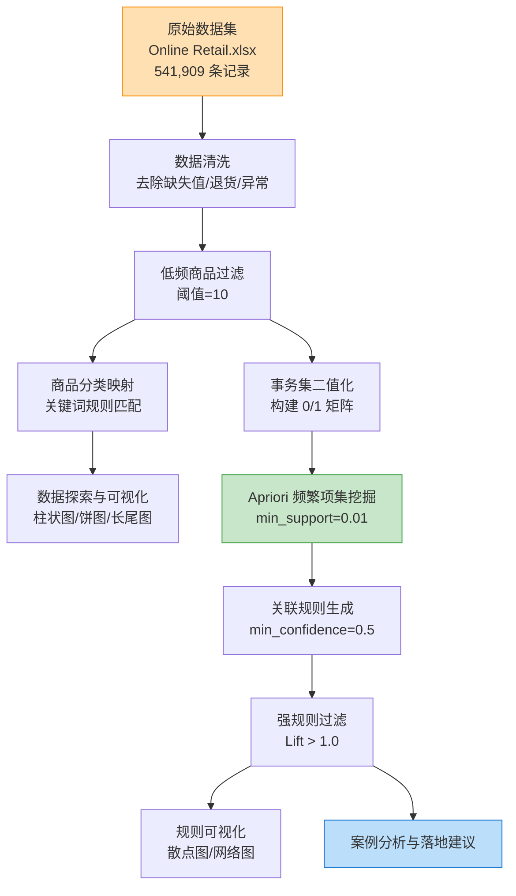
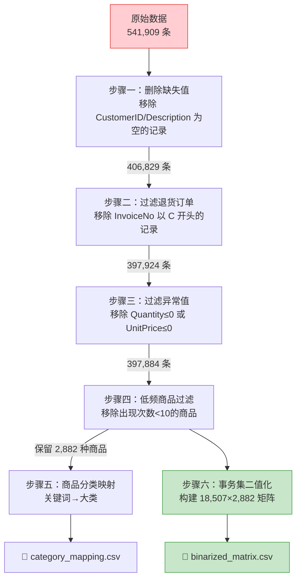
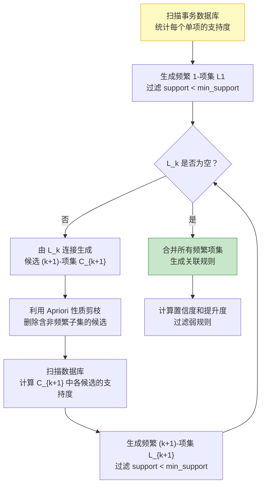

# 基于电商购物篮数据的协同关联规则挖掘

**摘要：** 在多媒体电商与大数据时代，精准挖掘用户购物行为中的潜在消费偏好，已成为电商平台提升核心竞争力的关键技术手段。本文针对经典的 Online Retail 电商交易数据集，采用 Apriori 关联规则挖掘算法，完成了一个从事务集构建、长尾效应探索、频繁项集挖掘到强关联规则可视化与推荐策略落地的完整数据挖掘流程。实验从 541,909 条原始交易记录出发，经过数据清洗、低频过滤与二值化处理后，构建了 18,507×2,882 的订单-商品事务矩阵；在最小支持度 0.01、最小置信度 0.5 的参数设定下，共挖掘出 1,031 个频繁项集与 323 条强关联规则（提升度均大于 1.0），最高提升度达到 61.81。通过对典型规则的深入分析，揭示了同系列商品套装购买、功能互补商品搭配消费等多种关联模式，并从商品捆绑销售、个性化推荐和货架陈列优化等维度提出了切实可行的电商运营落地建议。

**关键词：** 关联规则挖掘；Apriori算法；购物篮分析；频繁项集；电商推荐

---

## 1 前言

### 1.1 研究背景

随着互联网技术的快速发展和移动支付的全面普及，电子商务已深刻融入现代社会的日常消费场景。据统计，全球电商市场规模在近年来持续增长，线上购物已从最初的便捷补充演变为主流的消费模式。在海量交易数据不断积累的背景下，如何从浩如烟海的用户行为数据中挖掘出有价值的商业智能信息，已成为学术界和产业界共同关注的核心课题。

购物篮分析（Market Basket Analysis）是数据挖掘领域中一项经典且极具商业价值的技术。其核心思想在于通过分析消费者在单次购物行为中同时购买的商品组合，发现不同商品之间隐含的"共现关系"，从而为商家提供精准的运营决策支持。这项技术最早由零售行业巨头在上世纪 90 年代的超市销售数据分析中提出，著名的"啤酒与尿布"案例便是其典型应用，揭示了看似无关的商品之间存在的深层消费关联。

### 1.2 现存业务痛点

在传统的电商运营实践中，商品推荐与交叉销售策略主要依赖于运营人员的经验判断和人工分析。这种方式存在以下显著局限性：

**（1）人工分析的效率瓶颈。** 现代电商平台通常拥有数万甚至数十万种商品（SKU），依靠人工逐一分析商品之间的潜在关联关系，不仅耗时巨大，而且覆盖面极为有限。以本文所采用的数据集为例，仅过滤后便保留了 2,882 种商品，其两两组合的可能性高达 $C_{2882}^{2} = 4{,}153{,}921$ 种，远超人工分析的能力边界。

**（2）主观经验的局限性。** 人工推荐往往基于直觉和行业常识（如"买手机的用户可能需要手机壳"），容易忽略那些不符合常规认知但确实存在的隐式关联。例如，购买特定系列茶盘的客户高概率同时购买同系列牛奶壶这一规律，很难被人工经验所捕捉。

**（3）动态更新的滞后性。** 消费者偏好和商品关联关系会随着季节、促销活动、市场趋势等因素持续变化，人工维护的推荐规则难以实时跟踪和适应这种动态演变。

**（4）长尾效应的忽视。** 电商数据普遍存在典型的长尾分布特征——少数爆款商品占据绝大部分销量，而大量小众商品虽然单品销量较低，但其累积需求不可忽视。人工分析往往聚焦于热门商品，从而忽略了长尾商品中潜藏的有价值关联模式。

### 1.3 实验目标

针对上述痛点，本文采用关联规则挖掘技术中的经典 Apriori 算法，对真实的电商购物篮数据进行系统性的数据挖掘实验。具体实验目标如下：

1. 对电商交易数据集进行全面的探索性分析，揭示商品购买频次分布特征和长尾效应；
2. 完成数据清洗、低频过滤与事务集二值化等预处理流程，构建适用于关联规则挖掘的标准化事务矩阵；
3. 运用 Apriori 算法挖掘频繁项集，并基于支持度、置信度和提升度三大指标提取强关联规则；
4. 通过可视化手段（散点图、网络拓扑图）直观展示规则的分布特征与商品关联网络；
5. 结合挖掘结果提出面向电商平台运营的具体优化建议和落地策略。

本实验的整体技术路线如图 1 所示。

图 1 实验整体技术路线流程图

---

## 2 数据探索

### 2.1 数据集概述

本实验采用经典的 Online Retail 电商交易数据集，该数据集记录了一家位于英国的在线零售商在 2010 年 12 月至 2011 年 12 月期间的全部交易信息。数据集共包含 541,909 条交易记录和 8 个字段，各字段含义如表 1 所示。

表 1 Online Retail 数据集字段说明

| 字段名 | 数据类型 | 含义说明 |
|--------|----------|---------|
| InvoiceNo | String | 发票编号（订单号），以 "C" 开头表示退货订单 |
| StockCode | String | 商品编码，唯一标识一种商品 |
| Description | String | 商品描述（英文名称） |
| Quantity | Integer | 购买数量，负数通常表示退货 |
| InvoiceDate | Datetime | 交易发生的日期和时间 |
| UnitPrice | Float | 商品单价（英镑） |
| CustomerID | Float | 客户编号，部分记录存在缺失 |
| Country | String | 客户所在国家/地区 |

初步统计显示，原始数据集中存在 1,454 条 Description 缺失记录和 135,080 条 CustomerID 缺失记录，这些缺失值将在后续数据预处理阶段进行清理。

### 2.2 商品购买频次分析

在完成基本数据清洗后（详见第 3 章），我们对数据集中各商品的购买频次进行了统计分析。经过清洗与低频过滤后，数据集保留了 2,882 种有效商品，图 2 展示了购买频次排名前 20 的商品。

图 2 Top 20 高频商品购买频次柱状图

由图 2 可以观察到，购买频次最高的商品为"WHITE HANGING HEART T-LIGHT HOLDER"（白色心形挂式烛台），其购买次数高达 2,028 次，显著领先于其他商品。排名前 5 的商品依次为白色心形烛台（2,028 次）、三层摄政蛋糕架（1,723 次）、红色复古大号购物袋（1,618 次）、彩色鸟装饰品（1,408 次）和派对彩旗（1,396 次）。这些高频商品多为家居装饰类和生活用品类商品，反映了该零售商的主营业务方向和目标客户群体的消费偏好。

### 2.3 商品类别分布分析

由于原始数据集不包含显式的商品类别字段，本实验根据商品描述（Description）中包含的核心关键词，设计了一套基于规则的分类映射方案，将商品映射至更具行业实际意义的五大品类。具体映射规则为：
- **Furniture & Home Decor（家具与家居装饰）**：包含家具、椅子、桌子、灯饰、蜡烛、时钟、衣架、挂钩、壁挂镜框、地垫、绿植花盆等。
- **Kitchenware & Tableware（厨房与餐饮用品）**：包含杯子、餐盘、餐碗、储物罐、水瓶、水壶、餐具、锅具、咖啡茶具、托盘、烘焙模具等。
- **Gifts, Toys & Party（礼品、玩具与派对用品）**：包含玩具、洋娃娃、派对气球、彩旗、礼品盒/袋、包装纸、贺卡、圣诞用品、文具（笔、本、橡皮）等。
- **Food & Beverages（食品与饮料）**：包含糖果、巧克力、饮料、零食冲饮等。
- **Other（其他）**：不属于上述范畴的其他杂项商品。

各类别的购买频次分布如图 3 和表 2 所示。

图 3 商品大类分布饼图

表 2 商品大类购买频次统计

| 类别 | 购买频次 | 占比 |
|------|---------|------|
| Furniture & Home Decor（家具与家居装饰） | 123,514 | 31.3% |
| Kitchenware & Tableware（厨房与餐饮用品） | 102,743 | 26.0% |
| Gifts, Toys & Party（礼品、玩具与派对） | 77,436 | 19.6% |
| Other（其他杂项） | 76,626 | 19.4% |
| Food & Beverages（食品与饮料） | 14,438 | 3.7% |

分析可知，家具与家居装饰类（31.3%）和厨房餐饮用品类（26.0%）构成了该在线零售商的主要商品板块，合计贡献了超过 57.3% 的购买频次，这与该英国零售商主营家居装饰和礼品（Wholesale Giftware）的业务定位高度吻合。礼品玩具与派对类（19.6%）紧随其后，为派对及节日消费提供了支撑。食品与饮料（3.7%）占比较小，属于配套零售。这种大类的划分相较于之前单一物理特征的划分更加符合真实电商运营和分类管理的业务实践，能为后续跨品类的推荐和捆绑销售提供更具全局观的商业洞察。

### 2.4 长尾效应分析

长尾效应（Long-tail Effect）是电商领域的一个重要特征，指少数热门商品贡献了大部分销量，而大量小众商品虽然单品销量低，但总体占据了不可忽视的市场份额。图 4 从线性坐标和对数坐标两个视角展示了商品购买频次的分布情况。

图 4 商品购买频次长尾效应分析

由图 4 左图的线性坐标分布曲线可见，频次分布呈典型的右偏态分布，曲线在前部（排名靠前的商品）急剧下降，随后迅速趋于平缓并形成一条绵长的"尾巴"。具体而言，**排名前 10%（约 288 种）的商品贡献了约 40.0% 的总销量**，而排名后 50% 的商品（约 1,441 种）仅贡献了约 15% 的销量。

从图 4 右图的对数坐标视角可以更清晰地观察到，在双对数坐标系下，数据点近似呈现线性分布趋势，这表明商品的购买频次分布近似服从幂律分布（Power-law Distribution），即 $f(r) \propto r^{-\alpha}$，其中 $r$ 为商品排名，$\alpha$ 为衰减指数。这一特征是长尾效应的典型数学表现。

长尾效应的存在对关联规则挖掘具有重要影响：一方面，热门商品由于出现频率高，更容易被纳入频繁项集，形成的规则支持度较高但可能缺乏独特性；另一方面，长尾区域的小众商品之间可能隐藏着更具商业价值的强关联关系（高提升度），这正是 Apriori 算法的挖掘优势所在。

---

## 3 数据预处理

### 3.1 数据预处理流程概述

高质量的数据预处理是关联规则挖掘成功的基础。本实验的数据预处理流程包括数据清洗、低频过滤、商品分类映射和事务集二值化四个核心步骤，整体流程如图 5 所示。

图 5 数据预处理流程图

### 3.2 数据清洗

数据清洗的目标是消除原始数据中的噪声和不一致性，确保后续分析的准确性。本实验共执行了三项清洗操作，具体统计如表 3 所示。

表 3 数据清洗各步骤统计

| 清洗步骤 | 操作说明 | 移除记录数 | 剩余记录数 |
|----------|---------|-----------|-----------|
| 原始数据 | — | — | 541,909 |
| 删除缺失值 | 移除 CustomerID 或 Description 为空的记录 | 135,080 | 406,829 |
| 过滤退货订单 | 移除 InvoiceNo 以 'C' 开头的退货/取消订单 | 8,905 | 397,924 |
| 过滤异常值 | 移除 Quantity ≤ 0 或 UnitPrice ≤ 0 的记录 | 40 | 397,884 |

**（1）缺失值处理。** 原始数据中有 135,080 条记录的 CustomerID 字段为空，占总记录数的 24.9%。由于 CustomerID 缺失意味着无法追踪该交易的客户行为，Description 缺失则导致无法识别所购商品，因此将这些记录予以删除。

**（2）退货订单过滤。** 在 Online Retail 数据集中，InvoiceNo 以字母 'C' 开头的记录表示退货或取消交易。这类记录共 8,905 条，若不予以过滤，将在关联规则挖掘中引入虚假的商品共现关系，降低规则的可靠性。

**（3）异常值处理。** 在正常的购买行为中，商品数量（Quantity）和单价（UnitPrice）均应为正数。数据中存在 40 条 Quantity ≤ 0 或 UnitPrice ≤ 0 的异常记录，可能源于数据录入错误或特殊的促销活动（如赠品），予以移除。

经过上述三步清洗后，数据集从 541,909 条精简为 397,884 条有效交易记录，清洗率约为 26.6%。

### 3.3 低频商品过滤

在清洗后的数据集中，共包含 3,665 种不同的商品。然而，其中相当一部分商品的出现频次极低。若将这些低频商品保留在事务集中，一方面会大幅增加二值化矩阵的列维度，显著提升算法的时间和空间复杂度；另一方面，出现次数过少的商品几乎不可能满足最小支持度阈值，对频繁项集挖掘不产生实质性贡献。

本实验设定低频过滤阈值为 10，即仅保留在所有订单中累计出现次数不低于 10 次的商品。经过过滤，移除了 783 种低频商品，最终保留 2,882 种有效商品，商品种数减少了约 21.4%，有效控制了后续计算的规模。

### 3.4 事务集二值化

事务集二值化是将原始的交易记录转换为 Apriori 算法所需输入格式的关键步骤。具体操作为：以每个唯一的订单号（InvoiceNo）作为行标识，以每种商品的编码（StockCode）作为列标识，构建一个交叉矩阵。矩阵中的每个元素值为 0 或 1，其中 1 表示该订单中包含该商品，0 表示不包含。

最终构建的二值化矩阵维度为 **18,507 行（订单）× 2,882 列（商品）**，矩阵元素总数为 53,339,174 个，其中值为 1 的元素仅占 0.72%，**矩阵稀疏度高达 99.28%**。这意味着平均每个订单仅包含约 $2882 \times 0.0072 \approx 21$ 种商品，符合零售行业中"每次购物通常只买少量商品"的常识。高稀疏度也说明大多数商品之间不存在直接的共现关系，能够被 Apriori 算法挖掘出的有意义的频繁项集数量相对有限但更具价值。

### 3.5 商品 ID 与类别映射

为便于后续分析中对规则进行语义解读，本实验建立了商品编码（StockCode）、商品描述（Description）与商品大类（Category）之间的三级映射关系，并导出为 `category_mapping.csv` 文件。该映射表共包含 2,882 条记录，对于同一 StockCode 存在多条不同 Description 的情况（可能由拼写差异或商品更名导致），选取出现频率最高的描述作为标准名称。

---

## 4 建模分析

### 4.1 Apriori 算法原理

Apriori 算法是由 Agrawal 和 Srikant 于 1994 年提出的经典关联规则挖掘算法。其核心思想基于**先验性质（Apriori Property）**：如果一个项集是频繁的，则它的所有子集也必须是频繁的；反之，如果一个项集是非频繁的，则它的所有超集也不可能是频繁的。利用这一性质，算法可以在搜索过程中有效剪枝，大幅减少候选项集的数量。

算法的基本流程如下：

图 6 Apriori 算法流程图

在关联规则 $A \Rightarrow B$ 中，三个核心评价指标的数学定义如下：

$$\text{Support}(A \Rightarrow B) = P(A \cup B) = \frac{|T(A \cup B)|}{|T|}$$

$$\text{Confidence}(A \Rightarrow B) = P(B|A) = \frac{P(A \cup B)}{P(A)} = \frac{\text{Support}(A \cup B)}{\text{Support}(A)}$$

$$\text{Lift}(A \Rightarrow B) = \frac{P(B|A)}{P(B)} = \frac{\text{Confidence}(A \Rightarrow B)}{\text{Support}(B)}$$

其中，$T$ 为事务集合，$|T(A \cup B)|$ 为同时包含项集 $A$ 和 $B$ 的事务数量。**支持度**衡量规则的普遍性；**置信度**衡量规则的可靠性；**提升度**衡量前件对后件出现概率的增益效果，$\text{Lift} > 1$ 表示正相关，$\text{Lift} = 1$ 表示统计独立，$\text{Lift} < 1$ 表示负相关。

### 4.2 参数设定与挖掘结果

本实验使用 Python 的 mlxtend 库实现 Apriori 算法。在参数设定上，最小支持度设为 0.01（即至少 1% 的订单包含该项集，对应约 185 个订单），最小置信度设为 0.5（即规则的条件概率不低于 50%）。同时，对挖掘出的规则进一步过滤，仅保留提升度大于 1.0 的正相关规则。实验结果汇总如表 4 所示。

表 4 Apriori 挖掘结果汇总

| 指标 | 数值 |
|------|------|
| 输入矩阵维度 | 18,507 × 2,882 |
| 矩阵稀疏度 | 99.28% |
| 最小支持度阈值 | 0.01 |
| 最小置信度阈值 | 0.50 |
| 挖掘出的频繁项集数 | 1,031 |
| 生成的关联规则总数 | 323 |
| 提升度范围 | 2.89 ~ 61.81 |
| 支持度范围 | 0.0097 ~ 0.0297 |
| 置信度范围 | 0.5000 ~ 0.9073 |

实验共发现 1,031 个满足最小支持度约束的频繁项集，并从中生成了 323 条提升度大于 1.0 的强关联规则。表 5 列出了提升度排名前 10 的强关联规则。

表 5 Top 10 强关联规则（按提升度降序排列）

| 序号 | 前件（Antecedents） | 后件（Consequents） | 支持度 | 置信度 | 提升度 |
|------|---------------------|---------------------|--------|--------|--------|
| 1 | REGENCY TEA PLATE GREEN | REGENCY TEA PLATE PINK | 0.0109 | 0.7481 | 61.81 |
| 2 | REGENCY TEA PLATE PINK | REGENCY TEA PLATE GREEN | 0.0109 | 0.9018 | 61.81 |
| 3 | POPPY'S PLAYHOUSE BEDROOM + KITCHEN | POPPY'S PLAYHOUSE LIVINGROOM | 0.0101 | 0.7323 | 53.78 |
| 4 | POPPY'S PLAYHOUSE LIVINGROOM | POPPY'S PLAYHOUSE BEDROOM + KITCHEN | 0.0101 | 0.7381 | 53.78 |
| 5 | REGENCY MILK JUG PINK | REGENCY SUGAR BOWL GREEN | 0.0111 | 0.7574 | 52.30 |
| 6 | REGENCY SUGAR BOWL GREEN | REGENCY MILK JUG PINK | 0.0111 | 0.7687 | 52.30 |
| 7 | POPPY'S PLAYHOUSE LIVINGROOM + KITCHEN | POPPY'S PLAYHOUSE BEDROOM | 0.0101 | 0.8651 | 50.67 |
| 8 | POPPY'S PLAYHOUSE BEDROOM | POPPY'S PLAYHOUSE LIVINGROOM + KITCHEN | 0.0101 | 0.5886 | 50.67 |
| 9 | REGENCY TEA PLATE ROSES | REGENCY TEA PLATE PINK | 0.0106 | 0.6006 | 49.62 |
| 10 | REGENCY TEA PLATE PINK | REGENCY TEA PLATE ROSES | 0.0106 | 0.8795 | 49.62 |

### 4.3 关联规则散点图可视化

为直观展示 323 条强关联规则在支持度、置信度和提升度三个维度上的分布特征，绘制了图 7 所示的散点图。

图 7 关联规则散点图：支持度 vs 置信度（颜色和大小映射提升度）

从图 7 可以观察到以下特征：

**（1）支持度集中在低值区域。** 绝大多数规则的支持度分布在 0.01~0.015 的范围内，说明在包含近 3,000 种商品的大规模数据集中，任意两种商品同时出现在同一订单中的概率本身较低，这与 99.28% 的矩阵稀疏度相吻合。

**（2）置信度分布较为均匀。** 规则的置信度覆盖了 0.50~0.91 的宽阔区间，说明挖掘出的规则在可靠性上存在较大差异。高置信度（>0.80）的规则数量较少但质量更高，值得重点关注。

**（3）提升度与支持度呈负相关趋势。** 图中颜色最亮（提升度最高）的点几乎全部集中在左上角（低支持度、高置信度区域），这是因为高提升度的规则往往涉及小众但高度关联的商品组合，它们的绝对支持度不高但条件概率极大。

### 4.4 关联规则网络拓扑图

为进一步揭示商品之间的关联网络结构，选取提升度排名前 10 的关联规则构建了有向网络图，如图 8 所示。

图 8 Top 10 强关联规则网络拓扑图

在网络图中，每个节点代表一种商品（或商品组合），有向边表示关联规则的方向（前件→后件），边上标注了置信度（C）和提升度（L）值。可以清晰地识别出三个关联紧密的商品社区（Community）：

**社区一：REGENCY 系列茶具。** REGENCY TEA PLATE GREEN、REGENCY TEA PLATE PINK、REGENCY TEA PLATE ROSES 三种花色的茶盘之间形成了双向强关联网络，提升度均超过 49。同时 REGENCY SUGAR BOWL GREEN 和 REGENCY MILK JUG PINK 之间也存在强双向关联（Lift=52.30），反映了消费者购买同品牌系列餐具时的"成套购买"行为。

**社区二：POPPY'S PLAYHOUSE 玩具套装。** 包括 BEDROOM（卧室）、KITCHEN（厨房）和 LIVINGROOM（客厅）三个模块，形成了密集的多方向关联网络。任意两个模块之间均存在强关联，且三件同时购买的规则置信度高达 0.9073，说明消费者倾向于一次性购齐全套玩具屋组件。

**社区三：红色波点系列。** SET/6 RED SPOTTY PAPER CUPS（红色波点纸杯）和 SET/6 RED SPOTTY PAPER PLATES（红色波点纸盘）之间存在强双向关联（Lift=47.15），体现了派对用品的功能互补搭配消费特征。

---

## 5 结论

### 5.1 典型规则案例分析

基于本次实验挖掘出的 323 条强关联规则，本节选取三组最具代表性的规则进行深入的案例分析，探讨规则背后蕴含的消费者行为逻辑和商品关联共性。

**案例一：同系列商品的套装购买行为**

$$\text{REGENCY TEA PLATE GREEN} \Rightarrow \text{REGENCY TEA PLATE PINK}$$
$$\text{Support} = 0.0109, \quad \text{Confidence} = 0.7481, \quad \text{Lift} = 61.81$$

这是本次实验中提升度最高的关联规则。规则表明，购买了绿色摄政茶盘的消费者中，有 74.81% 同时也购买了粉色款，而该事件的发生概率是随机情况下的 61.81 倍。反向规则的置信度更是高达 90.18%（即购买粉色款的客户中 90% 也购买了绿色款）。

**消费者心理分析：** 这一规则深刻揭示了消费者在购买家居装饰类商品时的"凑齐成套"心理。同品牌、同系列但不同花色的商品天然具有搭配属性，消费者往往希望通过购买多个花色来丰富居家场景或满足送礼需求。这种购买模式在餐具、家纺、文具等品类中普遍存在。

**案例二：功能互补商品的搭配消费**

$$\text{POPPY'S PLAYHOUSE BEDROOM + KITCHEN} \Rightarrow \text{POPPY'S PLAYHOUSE LIVINGROOM}$$
$$\text{Support} = 0.0101, \quad \text{Confidence} = 0.7323, \quad \text{Lift} = 53.78$$

$$\text{POPPY'S PLAYHOUSE BEDROOM + LIVINGROOM} \Rightarrow \text{POPPY'S PLAYHOUSE KITCHEN}$$
$$\text{Support} = 0.0101, \quad \text{Confidence} = 0.9073, \quad \text{Lift} = 48.53$$

POPPY'S PLAYHOUSE（波比娃娃屋）是一款由多个模块组成的玩具产品，包括卧室、厨房和客厅三个独立组件。挖掘结果显示，消费者在购买其中任意两个组件后，购买第三个组件的概率极高（置信度 73%~91%），体现了**功能互补驱动的整套购买行为**。

**消费者心理分析：** 模块化玩具的设计天然鼓励消费者追求"完整性"。当家长为孩子购买了卧室和厨房模块后，客厅模块成为完成整套玩具的"最后一块拼图"，购买动机极为强烈。这一发现对玩具行业的产品设计和定价策略具有重要参考意义——可以考虑将首个模块定价较低以吸引首次购买，再通过模块间的强关联性带动后续组件的销售。

**案例三：场景驱动的配套消费**

$$\text{SET/6 RED SPOTTY PAPER CUPS} \Rightarrow \text{SET/6 RED SPOTTY PAPER PLATES}$$
$$\text{Support} = 0.0128, \quad \text{Confidence} = 0.8281, \quad \text{Lift} = 47.15$$

红色波点纸杯与红色波点纸盘是典型的派对用品搭配。82.81% 购买了纸杯的消费者同时也购买了纸盘，反映了消费者在特定**使用场景**（生日派对、节日聚会等）下的配套采购行为。

**消费者心理分析：** 这类规则的驱动力来自于明确的使用场景。当消费者为某一特定场景（如生日派对）进行采购时，会倾向于选择风格统一的全套用品。同色系、同主题的商品之间形成了天然的"场景捆绑"，使得商品之间的关联不是基于商品本身的功能互补，而是基于共同的使用语境。

### 5.2 算法参数优化建议

本次实验采用的参数组合（min_support=0.01, min_confidence=0.5）在大规模数据集上取得了较为理想的挖掘效果，但在实际应用中仍有进一步优化的空间：

**（1）支持度阈值的动态调整。** 固定的最小支持度阈值可能导致高频商品主导挖掘结果。建议引入类别自适应支持度（Category-aware Support），对不同品类的商品设定差异化的支持度门槛，使长尾商品中的有价值规则也能被有效挖掘。

**（2）算法效率优化。** 当商品种类进一步增加时，Apriori 的候选项集生成和多次数据库扫描会成为性能瓶颈。可考虑采用 FP-Growth 算法作为替代方案，该算法通过构建频繁模式树（FP-Tree）仅需两次数据库扫描，在大规模数据上具有更高的执行效率。

**（3）时序维度的引入。** 当前实验将所有交易视为静态集合，未考虑购买行为的时间序列特征。未来可引入序列关联规则挖掘或滑动窗口机制，捕捉"先买 A，后买 B"这类时序关联模式。

**（4）多维度指标综合评估。** 除支持度、置信度和提升度外，还可引入全置信度（All-Confidence）、最大置信度（Max-Confidence）和 Kulczynski 指标等高级度量标准，从多个角度综合评估关联规则的质量，减少高支持度/低相关性规则的干扰。

### 5.3 电商平台运营落地建议

基于本次实验的挖掘成果，从以下四个维度为电商平台运营提出具体的落地建议：

**（1）智能商品捆绑销售。** 针对强关联规则中的"套装购买"模式（如 REGENCY 系列茶具），平台可设计组合套餐，将多个高度关联的商品打包销售，并提供适当的套餐折扣。例如，将绿色、粉色和玫瑰花色的茶盘组合为"摄政系列三色茶盘套装"，既能提升客单价，又能降低消费者的决策成本。

**（2）购物车交叉推荐。** 在用户将某一商品加入购物车后，基于关联规则实时推荐高关联度的互补商品。例如，当用户选购红色波点纸杯时，弹窗推荐红色波点纸盘，并附加"搭配购买享 9 折优惠"的促销信息，利用场景驱动的配套消费心理促进追加购买。

**（3）商品陈列与仓储优化。** 在实体仓储和线上分类页面中，将高度关联的商品临近摆放或归入同一推荐栏目。例如，将 POPPY'S PLAYHOUSE 的三个模块在页面中集中展示，而非分散在不同的子类目中，缩短用户的发现路径，降低因信息分散导致的流失。

**（4）个性化邮件营销。** 对已购买某一关联组合中部分商品的客户，通过精准邮件营销推送其尚未购买的关联商品。例如，对购买了波比娃娃屋卧室和厨房模块但尚未购买客厅模块的客户发送定向推荐邮件，利用其"凑齐全套"的心理动机促成复购。

---

## 参考文献

[1] Agrawal R, Srikant R. Fast algorithms for mining association rules[C]. Proceedings of the 20th International Conference on Very Large Data Bases, 1994: 487-499.

[2] Han J, Pei J, Yin Y. Mining frequent patterns without candidate generation[J]. ACM SIGMOD Record, 2000, 29(2): 1-12.

[3] Chen D, Sain S L, Guo K. Data mining for the online retail industry: A case study of RFM model-based customer segmentation using data mining[J]. Journal of Database Marketing & Customer Strategy Management, 2012, 19(3): 197-208.

[4] 韩家炜, 堪博, 裴健. 数据挖掘：概念与技术[M]. 第3版. 北京: 机械工业出版社, 2012.

[5] 邓维斌, 闵帆. 数据挖掘导论[M]. 北京: 人民邮电出版社, 2020.

[6] Raschka S. MLxtend: Providing machine learning and data science utilities and extensions to Python's scientific computing stack[J]. Journal of Open Source Software, 2018, 3(24): 638.

[7] 张中秋. 基于改进Apriori算法的商品智能推荐[J]. 科技创新与应用, 2023, 13(4): 47-50.

[8] 董云薪, 曾俊伟, 宁佐华. 基于Apriori算法填充数据及改进相似度的推荐算法[J]. 计算机科学, 2022, 49(S2): 307-311.

[9] 宋倩. 基于关联规则算法的电商商品推荐系统设计[J]. 微型电脑应用, 2021, 37(12): 177-179.

[10] Satria A, Saputro D R S, Widyaningsih P. Market Basket Analysis of E-Commerce Transaction Data Using Apriori Algorithm[C]. AIP Conference Proceedings, 2023, 2736(1): 020014.

[11] Wang L. Application of Improved Apriori Algorithm in E-Commerce Recommendation System[C]. Journal of Physics: Conference Series, 2021, 1802(3): 032014.

[12] Huseynov F. Analyzing online consumer behavior using association rule mining: A case study[J]. International Journal of Electronic Commerce Studies, 2021, 12(1): 83-110.

[13] Boliubash A, Khodzitskyi V. Dynamic updating of association rules for e-commerce recommender systems[J]. International Journal of Intelligent Information and Database Systems, 2025, 18(1): 45-63.
